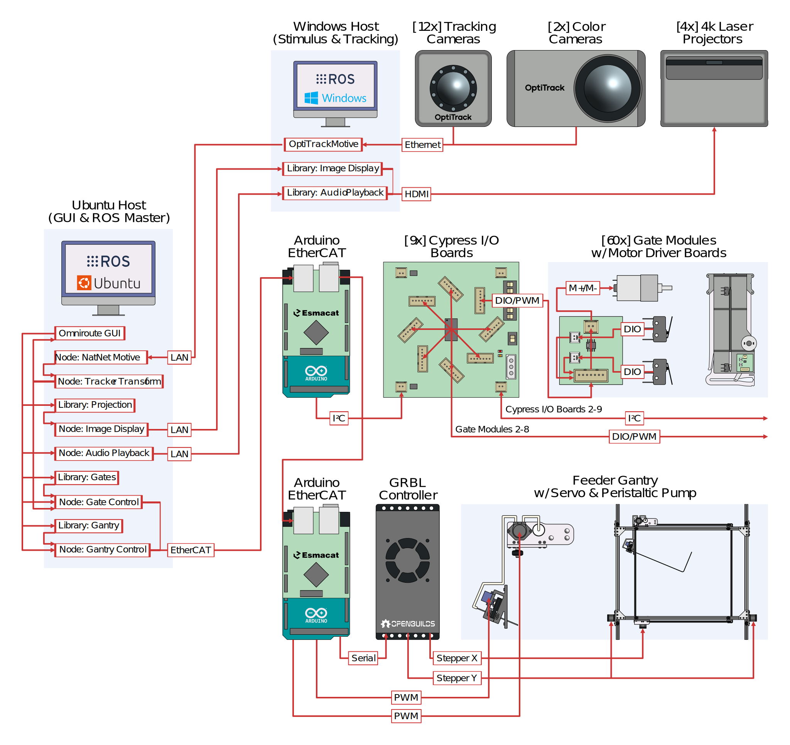

# Omniroute ROS Controller Setup and Usage (Ubuntu)

## Overview

This repository contains the Ubuntu ROS (Noetic) workspace used to control the Omniroute maze. It runs the ROS master, high-level behavioral logic, and the gate/gantry controller nodes, and provides the interface to the Windows-based tracking and projection workspace.

<p align="center">
  
</p>

## Setup

### Need to perform only once on a given OS
```
For ethercat_grant, you will likely need to install library libcap-dev

sudo apt install libcap-dev

After running catkin_make, copy executable into /usr/local/bin

sudo cp devel/lib/ethercat_grant/ethercat_grant /usr/local/bin
sudo chmod +s /usr/local/bin/ethercat_grant

Three packages may need to be installed:

sudo apt install libxmlrpcpp-dev liblog4cxx-dev librosconsole-dev
```

### Need to run this with each local repo clone

Start in omniroute_ubuntu_ws  

```
cd src/esmacat_master_software

mkdir build
cd build
cmake ..
make

cd ../../plog

mkdir build
cd build
cmake ..
make

cd ../../..

source /opt/ros/noetic/setup.bash

catkin_init_workspace src
```

# Note you may need to comment out any catkin_make alias in the .basher
```
sudo nano ~/.bashrc 
source ~/.bashrc
```

On Windows computer
```
catkin_make
```

### Change terminal starting directory

```
sudo nano ~/.bashrc
xdg-open ~/.bashrc
```

### Setup ethernet
```
change ethenet address for ethercat sheild in launch file:
src/omniroute_operation/launch/test.launch

```

### Run catkin_make after changing things
```
cd omniroute_ubuntu_ws

catkin_make
```

### Make python file executable
```
chmod +x sync_sender.py
```
### PlatformIO Ubuntu setup

After installig  platformio run the fullowing:
```
sudo apt install python3-venv
```
Give port write permissions. Note, ports will need to have devices connected:
```
sudo chmod a+rw /dev/ttyACM0
sudo chmod a+rw /dev/ttyACM1
```
Give complete port access. Note you need to logout or restart after running:
```
sudo usermod -aG dialout nc4-lassi
```

# Runtime

### Launching the ROS omniroute_controller
```
cd omniroute_ubuntu_ws

source devel/setup.bash

roslaunch omniroute_operation omniroute_controller.launch
```
### Changing ROS environment settings in Ubuntu

#### Check the IP address of the computer
```
ipconfig
```
Note the inet ip: 
```
enp11s0: flags=4163<UP,BROADCAST,RUNNING,MULTICAST>  mtu 1500
inet 10.34.5.184  netmask 255.255.255.128  broadcast 10.34.5.255
```
#### Edit the bashrc
```
nano ~/.bashrc
gedit ~/.bashrc &

export ROS_MASTER_URI=http://10.34.5.184:11311
export ROS_HOSTNAME=10.34.5.184
```

### Simple topic test
```
rosrun rospy_tutorials talker.py 

# Check global variables

echo $ROS_HOSTNAME

echo $ROS_MASTER_URI

```

### Running the 3x3 with gantry and optitrack

Windows computer:
```
Start Motive

Run projection code
```

Ubuntu computer:
```
roslaunch omniroute_operation omniroute_controller.launch

```

## Licensing

* **Hardware design files** (for the Omniroute apparatus) are released under the **CERN-OHL-W** license.
    
* **Analysis code in this repository** is released under the Apache-2.0 license (see `LICENSE`).